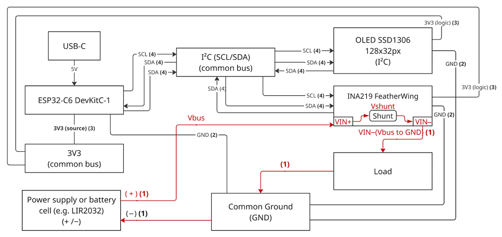
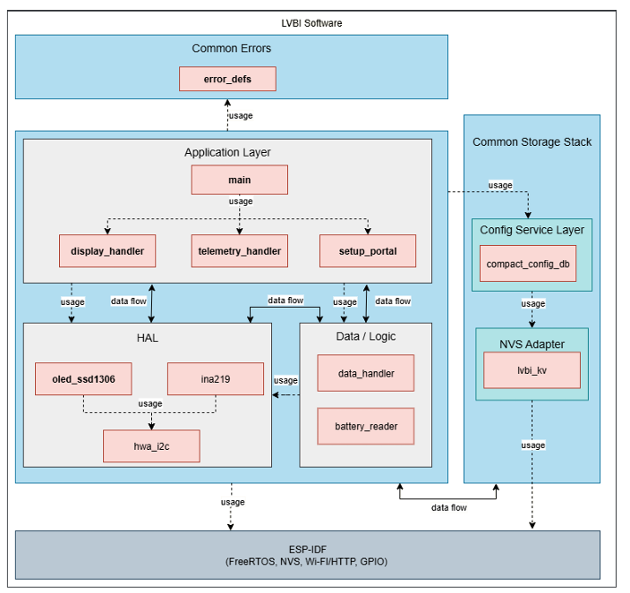

<div align="center">

# LVBI (Low Voltage Battery Instrumentation)

</div>

## Overview

LVBI (Low Voltage Battery Instrumentation) is an embedded firmware system based on ESP32-C6 for real-time monitoring of low-voltage battery parameters and fault conditions.

The system measures voltage, current, and estimated state of charge using an INA219 sensor and displays the data locally on an OLED display, with optional telemetry support.

⚠️ Note: The system is **read-only** and does not control or manage the battery (no charging/discharging logic).

---

## System Architecture

The system combines a simple hardware setup with a modular ESP-IDF-based software architecture.

### Hardware Overview

- ESP32-C6 as main controller (Wi-Fi + processing)
- INA219 current/voltage sensor (I2C)
- SSD1306 OLED display (I2C)
- Shared I2C bus for peripherals
- External battery or load connected through shunt resistor

See Figure 1 for the full hardware block diagram.



---

### Software Architecture

The firmware follows a layered and modular design using ESP-IDF and FreeRTOS.

**Main layers:**
- **Application Layer**
  - `display_handler`
  - `telemetry_handler`
  - `setup_portal`

- **Data / Logic Layer**
  - `battery_reader`
  - `data_handler`

- **HAL (Hardware Abstraction Layer)**
  - `ina219`
  - `oled_ssd1306`
  - `hwa_i2c`

- **Storage Layer**
  - `compact_config_db`
  - `lvbi_kv` (NVS adapter)

- **Common**
  - `error_defs`

See Figure 2 for a simplified software architecture diagram.



---

## Data Flow

Battery → INA219 → battery_reader → data_handler → display_handler / telemetry_handler

---

## Key Features

- Real-time voltage/current acquisition via INA219 (I2C)
- Local visualization via SSD1306 OLED
- Wi-Fi provisioning via captive portal (SoftAP)
- Persistent configuration storage using NVS abstraction layer
- Modular ESP-IDF component-based architecture
- Centralized error handling using bitmask-based error flags
- Optional deep sleep mode for energy-efficient operation

---

## Design Notes

- Built on ESP-IDF (v5.4) with FreeRTOS for task scheduling
- I2C shared bus architecture for simplicity and extensibility
- Separation between HAL and application logic for maintainability
- Lightweight configuration storage instead of full database
- Power-aware design including optional deep sleep transitions based on system state

---

## Ubidots Alerts (Low SoC)

Ubidots supports Events (rules) to notify when a variable crosses a threshold. To get an email/SMS when the battery SoC is low:

1. Open your device in Ubidots and select the SoC variable.
2. Create an Event with trigger "SoC < X%" (e.g., 20%).
3. Add an action (Email/SMS/Telegram/Webhook) and customize the message.

Note: Alerts require periodic telemetry; ensure the device is configured with a valid token and online cadence that fits your needs.

---

## Quick Start & Project Setup

This section covers how to set up the exact ESP-IDF toolchain version used (v5.4.0), build/flash the firmware, generate documentation, and wire the hardware.

---

### 1. Prerequisites
* Git
* Python 3.9–3.11 (ESP-IDF managed virtual env will be created automatically)
* USB-to-UART driver (CP210x / FTDI depending on your dev board)
* 8 MB flash ESP32-C6 module/board

---

### 2. Obtain ESP-IDF v5.4.0
Clone the official framework at the matching version (the firmware was built against `ESP-IDF 5.4.0`, see `sdkconfig.h`).

PowerShell (Windows):
```powershell
git clone -b v5.4.0 --recursive https://github.com/espressif/esp-idf.git C:\esp\esp-idf
& C:\esp\esp-idf\install.bat
```

Linux/macOS:
```bash
git clone -b v5.4.0 --recursive https://github.com/espressif/esp-idf.git ~/esp/esp-idf
~/esp/esp-idf/install.sh
```

---

### 3. Activate Environment Each Session
PowerShell:
```powershell
& C:\esp\esp-idf\export.ps1
```
Linux/macOS:
```bash
source ~/esp/esp-idf/export.sh
```

You should now have `idf.py` on PATH and the correct RISC-V toolchain available.

---

### 4. Clone This Project
```powershell
git clone https://github.com/jpetrovic95/LVBI.git
cd LVBI
```

---

### 5. Set Target & Build
```powershell
idf.py set-target esp32c6
idf.py build
```

---

### 6. Flash & Monitor
Connect the board in download mode if required (usually automatic on dev boards):
```powershell
idf.py -p COM5 flash monitor   # Replace COM5 with your serial port
```
Exit the monitor with `Ctrl+]` (default IDF shortcut) or `Ctrl+T` then `Ctrl+Q`.

---

### 7. First Boot Behavior
* If no Wi‑Fi credentials are stored, the device starts a SoftAP named `LVBI-Setup` and a captive configuration portal.
* After provisioning, subsequent boots attempt Wi‑Fi up to 3 times; on failure it remains in offline battery display mode (no auto portal unless long‑press invoked).
* Hold the BOOT button (GPIO9, active low) for the configured long‑press duration (currently 3 s) at any time to re-enter the portal.

---

### 8. Regenerating Configuration (Portal)
Long‑press BOOT → device switches to SoftAP, suspends main tasks, and shows a configuration screen. Update credentials / thresholds, then reboot or exit per portal instructions.

---

## Documentation (Doxygen & Diagrams)

### 1. Install Tools
Minimum:
* Doxygen (1.9.x+)
* Graphviz (for call + dependency graphs)

Optional (for rich UML / sequence diagrams):
* Java 11+ runtime
* PlantUML JAR (if you want extra local diagrams outside the provided Mermaid blocks)

---

### 2. Generate HTML Docs
The repository provides a `Doxyfile` tuned for the project layout.
```powershell
doxygen Doxyfile
```
Output (default): `docs/html/index.html`.

---

### 3. Re-run After Code Changes
Rebuild docs any time public headers or architecture diagrams change:
```powershell
doxygen Doxyfile
```

---

## Hardware & GPIO Connections

| Function / Signal | GPIO | Direction | Notes |
|-------------------|------|-----------|-------|
| I2C SDA           | 4    | Bi-dir    | Internal pull-ups enabled via driver config (also add 4.7–10 kΩ external if bus unstable). Shared by INA219 + SSD1306. |
| I2C SCL           | 5    | Output    | 50 kHz configured (`HWA_I2C_CLIENT_FREQ_HZ`). |
| BOOT Button       | 9    | Input     | Active LOW, internal pull-up, long‑press (~3 s) enters setup portal at runtime. |
| 3V3               | —    | Power     | Supply for ESP32-C6 module, INA219 VCC, SSD1306 VCC. |
| GND               | —    | Ground    | Common ground reference. |
| Battery + / –     | —    | Analog    | Routed through shunt resistor/INA219 (pack leads across INA219 inputs). |

Additional Notes:
* Both INA219 and SSD1306 are I2C devices on the same bus; addresses must not collide (typical SSD1306 0x3C / INA219 0x40).
* Keep I2C traces short; Good to have: add 0.1 µF decoupling caps near sensor & display modules.
* If you experience bus noise, lower the frequency (see `HWA_I2C_CLIENT_FREQ_HZ`) or strengthen pull-ups (e.g. 4.7 kΩ).

---

## Eclipse CDT (Optional IDE for Editing, Flashing & Debugging)

You can use Eclipse as an alternative to VS Code / CLI for this ESP-IDF project.

### Option A: Official Espressif Eclipse Plugin (Recommended)
1. Install "Eclipse IDE for C/C++ Developers" (2024‑xx or newer).
2. Help > Eclipse Marketplace… search for "Espressif IDF" and install the plugin.
3. When prompted, set:
	* ESP-IDF path: `C:/esp/esp-idf` (or your clone)
	* Python: auto-detected from the ESP-IDF virtual env
4. File > Import > Espressif > Existing IDF Project, select the LVBI folder.
5. Build via the ESP-IDF toolbar (hammer icon) – plugin calls `idf.py build`.
6. Flash: select correct serial port (Project Properties > C/C++ Build > Environment or plugin settings) then click the flash icon (runs `idf.py -p <PORT> flash`).
7. Monitor: use the plug icon (opens an integrated serial monitor). Exit with the toolbar stop button.
8. Debug (USB-JTAG built into ESP32-C6 dev boards):
	* New > ESP-IDF Debugging > OpenOCD Debug.
	* Target: esp32c6
	* Interface: usb / default (built-in)
	* Launch – Eclipse starts OpenOCD + GDB; set breakpoints in `main.c`.

---

### Option B: Pure CDT (Generic CMake Import)
1. Launch a terminal, run the ESP-IDF `export.ps1` / `export.sh` script, then start Eclipse from that same terminal so environment vars persist.
2. File > Import > C/C++ > Existing CMake Project; choose repository root.
3. Specify build folder: `build` (already generated by `idf.py build` so `compile_commands.json` is present for indexer).
4. Create an External Tool configuration for flash:
	* Program: `idf.py`
	* Arguments: `-p COMx flash`
	* Working dir: project root.
5. (Optional) Another tool for monitor: `idf.py -p COMx monitor`.
6. Debugging: easier with the official plugin; otherwise launch OpenOCD manually then attach `riscv32-esp-elf-gdb` to the produced ELF.

---

### Notes
* Always keep framework version at 5.4.0 to avoid silent ABI/config drifts.
* Regenerate `compile_commands.json` after `menuconfig` or major component changes: `idf.py build`.
* If IntelliSense / indexer misses headers, ensure the `build` directory is marked as a CMake build folder and not excluded.

---